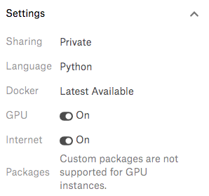
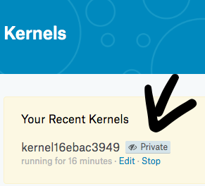
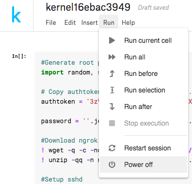

# SSH Kaggle Kernel Setup :rocket:
Quick script to setup SSH to Kaggle Kernel for Deep Learning. In order to use that sexy P100 for free :P

## **How setup SSH connection**

- **Step 1:** Create a [new Kaggle kernel](https://www.kaggle.com/kernels) 

- **Step 2:** Go to Kernel Settings and turn on `GPU` and `Internet`

    

- **Step 3:** Copy the whole content of the [get_ssh.py](./get_ssh.py)

- **Step 4:** Click `Commit` on the top right conner and wait a minutes for everything to set up. You should see a pop-up windows

    Save the`Root user` , `Root password` and `Port` to somewhere else since you won't be able to see this information after you close this windown

## **How to SSH**    
- `ssh -J teleport.anhdh.com root@User -p Port` <-- port number dictated in above output
- With root password also dictated in above output
- You can turn off the browser, disconnect from the server and it will still running. But keep in mind this server can only live for ***9 hours*** at max.

## **How to quickly setup the server**
- Kaggle Kernel already provide many Machine Learning and Deep Learning package and library ready to use with a powerful **NVIDIA Tesla P100 GPU** so you might be good to go. But if you want something more that I usually use. Run this to get more:
    ```bash
    cd ~
    wget https://github.com/lamhoangtung/kaggle-kernel-setup/raw/master/install_common.sh
    chmod 777 install_common.sh
    ./install_common.sh
    ```
    And follow the instruction.

- You only need to `Commit` again in the same kernel to get everything up and running again after terminate the server. `Root password` and host address information will be reset each time you commit.
- You will need multiple `Kaggle` account to get multiple server at the same time.  

## **How to terminate the server**
- Go to https://www.kaggle.com/kernels and look at the `Your Recent Kernels` section and hit `Stop`.

    
- If you encounter any problem while setting up the connection. Please terminate the server as above. Then open the kernel in editor mode and go to `Run > Power off`, then turn it on manually.

    
- Keep in mind everything will be lost (including process and files, ...) when you `Power off` or `Terminate` the kernel
```bash
scp -o "ProxyJump teleport.anhdh.com" -rp face-recognition root@kaggle:/root/projects
```
